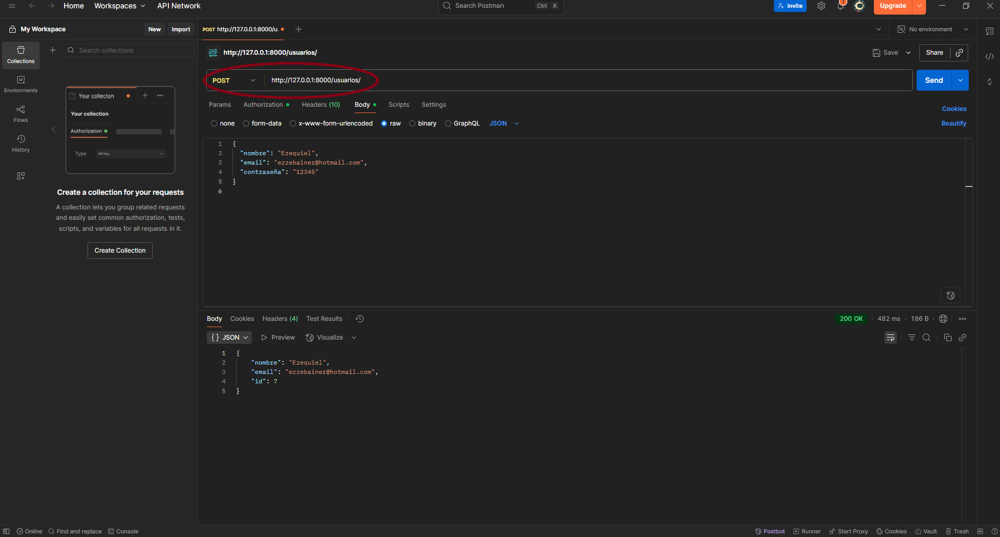

# 📝 To Do App - API con FastAPI

Una API RESTful para gestionar **usuarios y tareas**, desarrollada con **FastAPI** y **SQLAlchemy**.  
Incluye **autenticación con JWT**, manejo de dependencias y documentación automática.

---

## 📌 Tabla de Contenidos
- [📝 To Do App - API con FastAPI](#-to-do-app---api-con-fastapi)
  - [📌 Tabla de Contenidos](#-tabla-de-contenidos)
  - [1)✨ Características](#1-características)
  - [2)⚙️ Instalación](#2️-instalación)
  - [6) 📸 Ejemplos en Postman](#6--ejemplos-en-postman)
  - [7) 🛠 Tecnologías utilizadas](#7--tecnologías-utilizadas)
  - [📄 Licencia](#-licencia)
  - [✍️ Desarrollado por **Ezequiel Bainer**](#️-desarrollado-por-ezequiel-bainer)
  - [📧 Contacto: ezzebainer@hotmail.com](#-contacto-ezzebainerhotmailcom)

---

## 1)✨ Características
- CRUD de usuarios y tareas
- Autenticación con **JWT**
- Organización modular en routers
- Validaciones con **Pydantic**
- Base de datos con **SQLAlchemy**
- Documentación automática con Swagger (`/docs`)

---

## 2)⚙️ Instalación
- Clonar el repositorio:
   ```bash
   git clone https://github.com/TU_USUARIO/todo-fastapi.git
   cd "\Escritorio\Cosas\Proyectos\Portafolios\To Do App\fastapi_todo" 
    ```
- Crear entorno virtual e instalar dependencias:
   python -m venv venv
   source venv/bin/activate  # En Linux/Mac
   venv\Scripts\activate     # En Windows
   pip install -r requirements.txt

- Configurar variables de entorno:
   Crear un archivo .env en la raíz del proyecto con:
   DATABASE_URL=sqlite:///./todo.db
   SECRET_KEY=tu_clave_secreta
   ALGORITHM=HS256
   ACCESS_TOKEN_EXPIRE_MINUTES=30
---
## 3)▶️ Ejecución
- En bash:
  ```bash 
  uvicorn app.main:app --reload
    ```
- La API estará disponible en:
  
  Swagger UI: http://127.0.0.1:8000/docs

  Redoc: http://127.0.0.1:8000/redoc
---
## 4) 🔗 Endpoints principales  

| Método    |     Endpoint         | Descripción              |
|---------|-----------------|--------------------------|
| 🔵**POST**   | `/usuarios/`      | Crear usuario            |
| 🟢**GET**    | `/usuarios/`      | Listar usuarios          |
| 🟢**GET**    | `/usuarios/{id}`  | Obtener usuario por ID   |
| 🟠**PUT**    | `/usuarios/{id}`  | Actualizar usuario       |
| 🔴**DELETE** | `/usuarios/{id}`  | Eliminar usuario         |
| 🔵**POST**   | `/login`          | Autenticación JWT        |
| 🔵**POST**   | `/tareas/`        | Crear tarea              |
| 🟢**GET**    | `/tareas/`        | Listar tareas            |
| 🟢**GET**    | `/tareas/{id}`    | Obtener tarea por ID     |
| 🟠**PUT**    | `/tareas/{id}`    | Actualizar tarea         |
| 🔴**DELETE** | `/tareas/{id}`    | Eliminar tarea           |
---
## 5)🔐 Autenticación
Para acceder a la mayoría de los endpoints, se requiere un **token JWT.**
1) Hacer login en `/login` enviando:

- **username** → email del usuario

- **password** → contraseña

2) Copiar el `access_token` recibido.

3) Enviar el token en el header:
```makefile 
Authorization: Bearer <token>
```
---
## 6) 📸 Ejemplos en Postman


---
## 7) 🛠 Tecnologías utilizadas
- FastAPI

- SQLAlchemy

- Pydantic

- Uvicorn

- SQLite 

---
## 📄 Licencia ##
Este proyecto está bajo la licencia MIT - podés usarlo libremente.

---

✍️ Desarrollado por **Ezequiel Bainer**
---
📧 Contacto: ezzebainer@hotmail.com
---